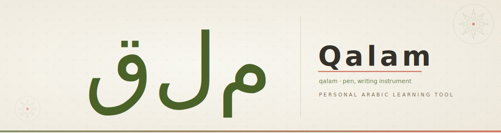
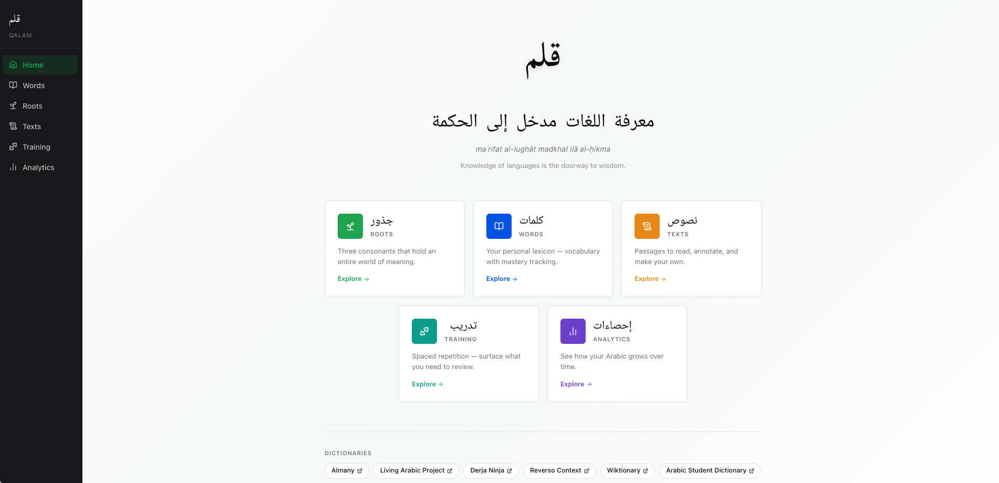
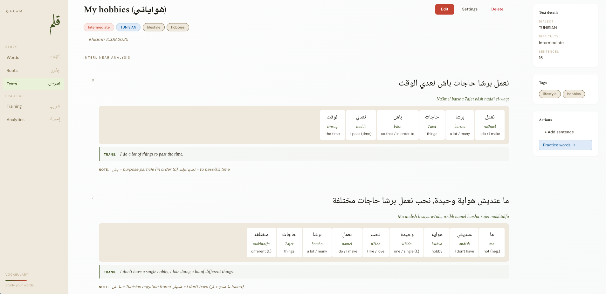
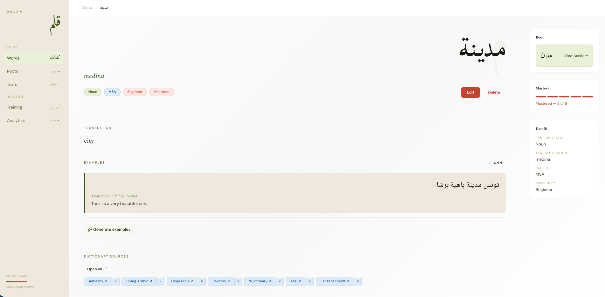
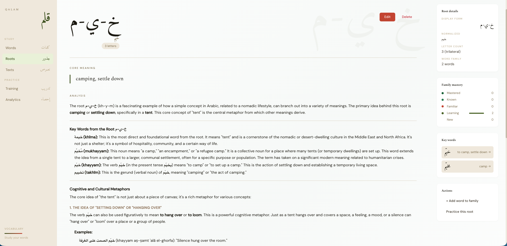

<div align="center">
  
</div>

<div align="center">

[](https://github.com/amasotti/qalam/actions/workflows/ci.yml)
[](https://github.com/amasotti/qalam/actions/workflows/e2e-frontend.yml)
[](https://github.com/amasotti/qalam/actions/workflows/release.yml)


[](https://opensource.org/licenses/MIT)

</div>

---

*Qalam* (قلم — "pen") manages Arabic texts with interlinear glosses, a root-linked vocabulary
graph, and SRS flashcard drills. The backend is Ktor on Kotlin 2 with Arrow-typed service
boundaries, Exposed as the SQL DSL, and a clean onion architecture; the frontend is SvelteKit on
Svelte 5 runes with Tailwind v4. Built for one user — the developer — but open for anyone to explore, fork, or steal ideas from.

| Layer    | Stack                                                         |
|----------|---------------------------------------------------------------|
| Backend  | Kotlin 2.3 · Ktor 3.x · Exposed · Arrow · Koin               |
| Frontend | SvelteKit · Svelte 5 runes · Tailwind v4 · shadcn-svelte      |
| Database | PostgreSQL 17 · Flyway · `pg_trgm` · `unaccent`               |
| AI       | OpenRouter — optional, degrades gracefully to 503 without key |
| Tooling  | just · Doppler · Docker Compose · GitHub Actions              |

---

<table>
  <tr>
    <td width="50%" align="center">
      <br/>
      <sub>Home — module overview</sub>
    </td>
    <td width="50%" align="center">
      <br/>
      <sub>Interlinear gloss — token-by-token alignment</sub>
    </td>
  </tr>
  <tr>
    <td align="center">
      <br/>
      <sub>Word detail — mastery, examples, dictionary links</sub>
    </td>
    <td align="center">
      <br/>
      <sub>Root detail — trilateral root with AI-generated meaning notes</sub>
    </td>
  </tr>
</table>

---

## Features

### نصوص — Texts

Arabic passages with optional transliteration and translation, tagged by dialect (MSA, Tunisian,
Egyptian, Levantine, and more) and difficulty. A plain annotated view and a sentence-level
interlinear gloss view are properties of the same text entity — not separate content types. Select
any span to open an annotation form; annotations link back to vocabulary entries.

### جذور — Roots

Arabic's trilateral root system is a first-class citizen. Each word links to its root; the root
page shows the derivation graph and an AI-generated semantic note covering the root's core meaning,
its derived forms, and how meaning shifts across them. All graph queries are depth-limited to
prevent runaway traversal on the self-referential `derivedFrom` relation.

### كلمات — Words

Full word entries: part of speech, dialect, mastery level (unseen → learning → reviewing →
mastered), example sentences with transliteration, and a curated set of dictionary links (Almaany,
Living Arabic Project, Darja Ninja, Reverso, Wiktionary, and others). The AI layer can generate
additional examples on demand; it is disabled cleanly when no API key is configured.

### تدريب — Training

Session-based SRS flashcard drills. Each session surfaces words due for review based on mastery
level. A correct answer promotes the word; an incorrect one holds it at the current level. No
external SRS library — the scheduling logic is intentionally simple and fully owned.

### إحصاءات — Statistics

Vocabulary growth over time, mastery distribution across the full word set, and per-dialect
breakdowns. Useful for seeing where gaps are and how the knowledge base is growing.

---

## Getting started

**Prerequisites:**

| Tool    | Version | How to install                                                    |
|---------|---------|-------------------------------------------------------------------|
| JDK     | 25      | [sdkman](https://sdkman.io/): `sdk install java 25-tem`           |
| just    | latest  | `brew install just` / system package                              |
| Doppler | latest  | [doppler.com/docs/install](https://docs.doppler.com/docs/install) |
| Node.js | 24      | system package / nvm                                              |
| pnpm    | latest  | `corepack enable && corepack prepare pnpm@latest --activate`      |
| Docker  | any     | Docker Desktop or Colima                                          |

`JAVA_HOME` must point to JDK 25 (sdkman sets this automatically). Doppler can be swapped for
Vault, Infisical, or a plain `.env` file.

**One-time setup:**

```bash
doppler login
doppler setup    # project: qalam, config: dev
```

**Run everything:**

```bash
just run         # Postgres + backend + frontend
```

**Run in parts:**

```bash
just start-db    # Postgres only (Docker Compose)
just backend     # Ktor backend (requires DB)
just frontend    # SvelteKit dev server (requires backend)
just test        # backend tests (Testcontainers — no external DB needed)
just stop-db     # shut down Postgres
```

---

## Access points

| Service    | URL                                        |
|------------|--------------------------------------------|
| Frontend        | http://localhost                           |
| API             | http://localhost/api/v1/                   |
| Swagger UI      | http://localhost/api/v1/swagger-ui         |
| Health          | http://localhost/health                    |
| Traefik dashboard | http://localhost:8083                    |

Full documentation lives in [`docs/`](docs/).

---

## License

MIT — see [LICENSE](LICENSE).
